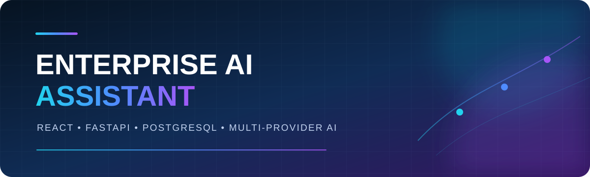
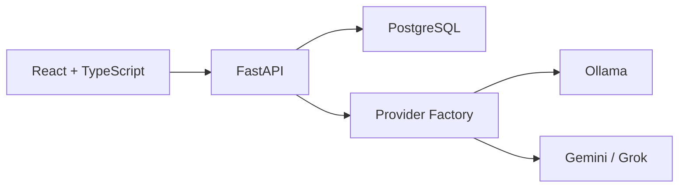

<p align="center">
  
</p>

<p align="center">
  <strong>Plataforma corporativa de IA com chat, histórico e múltiplos provedores de modelos.</strong>
</p>

<p align="center">
  
  
  
  
  
  
</p>

## Sobre o projeto

O **Enterprise AI Assistant** é uma aplicação full stack criada para centralizar conversas corporativas com inteligência artificial. A plataforma mantém o histórico por conversa, permite trocar o provedor e o modelo utilizado e prepara a base para consulta de documentos, relatórios e RAG.

O projeto demonstra uma arquitetura desacoplada: a interface React consome uma API FastAPI, o SQLAlchemy gerencia a persistência e uma camada de providers abstrai Ollama, Gemini e Grok.

> O sistema está em desenvolvimento. Chat e configuração de modelos estão funcionais; autenticação, documentos e relatórios fazem parte do roadmap.

## Visão rápida

| Recurso | Descrição | Status |
|---|---|---|
| Chat com IA | Conversas e mensagens persistidas por usuário | Funcional |
| Múltiplos provedores | Ollama local, Gemini e Grok | Funcional |
| Configuração de modelo | Provedor, modelo e teste de conexão pela interface | Funcional |
| Markdown | Respostas com listas, tabelas e blocos de código | Funcional |
| Documentos e RAG | Upload, processamento e busca contextual | Planejado |
| Relatórios | Métricas de uso e acompanhamento | Planejado |
| Autenticação | Contas e isolamento real por usuário | Planejado |

## Interface

A interface já contempla dashboard, conversas, histórico, documentos, relatórios e configurações de IA. As capturas de tela serão publicadas quando o fluxo visual estiver consolidado, evitando documentar telas provisórias como se fossem a versão final.

## Arquitetura



O padrão **Strategy** define um contrato comum para os modelos. A `ProviderFactory` escolhe a implementação conforme a configuração do usuário, permitindo trocar o provedor sem alterar as regras do chat.

## Tecnologias

### Back-end

- Python, FastAPI e Uvicorn
- SQLAlchemy e PostgreSQL
- Pydantic
- LangChain Ollama
- SDKs do Google Gemini e da OpenAI, usado com a API da xAI

### Front-end

- React e TypeScript
- Vite e Tailwind CSS
- React Router
- Axios
- React Markdown e Remark GFM

## Estrutura de pastas

```text
enterprise-ai-assistant/
├── Backend/
│   ├── App/
│   │   ├── database/       # Conexão e models SQLAlchemy
│   │   ├── routers/        # Endpoints da API
│   │   ├── schemas/        # Validação com Pydantic
│   │   ├── services/       # Regras de negócio e providers de IA
│   │   └── main.py         # Aplicação FastAPI
│   └── requirements.txt
├── Frontend/
│   ├── public/             # Recursos estáticos
│   └── src/                # Components, Pages, Services e rotas
├── Docs/
│   └── infs.env.example    # Modelo seguro de configuração
└── README.md
```

## Instalação

### Pré-requisitos

- Python 3.10 ou superior
- Node.js 20 ou superior
- PostgreSQL ou um projeto Supabase
- Ollama, caso queira executar modelos locais

### 1. Back-end

```bash
cd Backend
python -m venv .venv
```

No Windows:

```powershell
.venv\Scripts\activate
pip install -r requirements.txt
cd App
uvicorn main:app --reload
```

No Linux ou macOS:

```bash
source .venv/bin/activate
pip install -r requirements.txt
cd App
uvicorn main:app --reload
```

A API ficará disponível em `http://127.0.0.1:8000` e a documentação interativa em `http://127.0.0.1:8000/docs`.

### 2. Variáveis de ambiente

Copie `Docs/infs.env.example` para `Docs/infs.env` e preencha somente no ambiente local:

| Variável | Obrigatória | Uso |
|---|---|---|
| `DATABASE_URL` | Sim | Conexão SQLAlchemy com PostgreSQL |
| `SUPABASE_URL` | Não | URL do projeto Supabase |
| `SUPABASE_KEY` | Não | Chave usada em futuras integrações com Supabase |

Nunca publique o arquivo preenchido ou chaves de API reais.

### 3. Front-end

```bash
cd Frontend
npm install
npm run dev
```

Abra `http://localhost:5173`.

### 4. Modelo local com Ollama

```bash
ollama pull qwen3:8b
ollama serve
```

Depois, selecione **Ollama** e o modelo baixado na tela de configurações.

## Exemplo de uso da API

Criar uma conversa:

```bash
curl -X POST http://127.0.0.1:8000/chat/conversas \
  -H "Content-Type: application/json" \
  -d '{"titulo":"Análise de documentos"}'
```

Enviar uma mensagem:

```bash
curl -X POST http://127.0.0.1:8000/chat/1/mensagens \
  -H "Content-Type: application/json" \
  -d '{"usuario":"user","texto":"Resuma os principais pontos."}'
```

## Roadmap

- [x] Estrutura inicial do front-end e back-end
- [x] Conversas e histórico de mensagens
- [x] Providers Ollama, Gemini e Grok
- [x] Configuração de IA pela interface
- [ ] Autenticação e autorização
- [ ] Upload e processamento de documentos
- [ ] RAG com busca vetorial
- [ ] Streaming de respostas
- [ ] Relatórios e métricas
- [ ] Migrações com Alembic
- [ ] Testes automatizados e integração contínua

## Segurança

- Use arquivos de ambiente apenas localmente.
- Revogue imediatamente qualquer credencial publicada por engano.
- Não armazene chaves de produção em bancos locais ou no front-end.
- Restrinja CORS e permissões antes de publicar a aplicação.

## Qualidade e integração contínua

Cada Pull Request e atualização da branch principal executa automaticamente:

- lint e build do front-end;
- compilação estática dos arquivos Python do back-end.

O workflow está em `.github/workflows/ci.yml` e ajuda a impedir que erros básicos cheguem à branch principal.

## Autor

**Ruan Rabello**

[LinkedIn](https://www.linkedin.com/in/ruan-rabello-da-silva-9032b5274/) · [Portfólio](https://ruanportifolio.lovable.app) · [GitHub](https://github.com/Ruanrabello)

## Licença

Este projeto está disponível sob a licença MIT do repositório.
